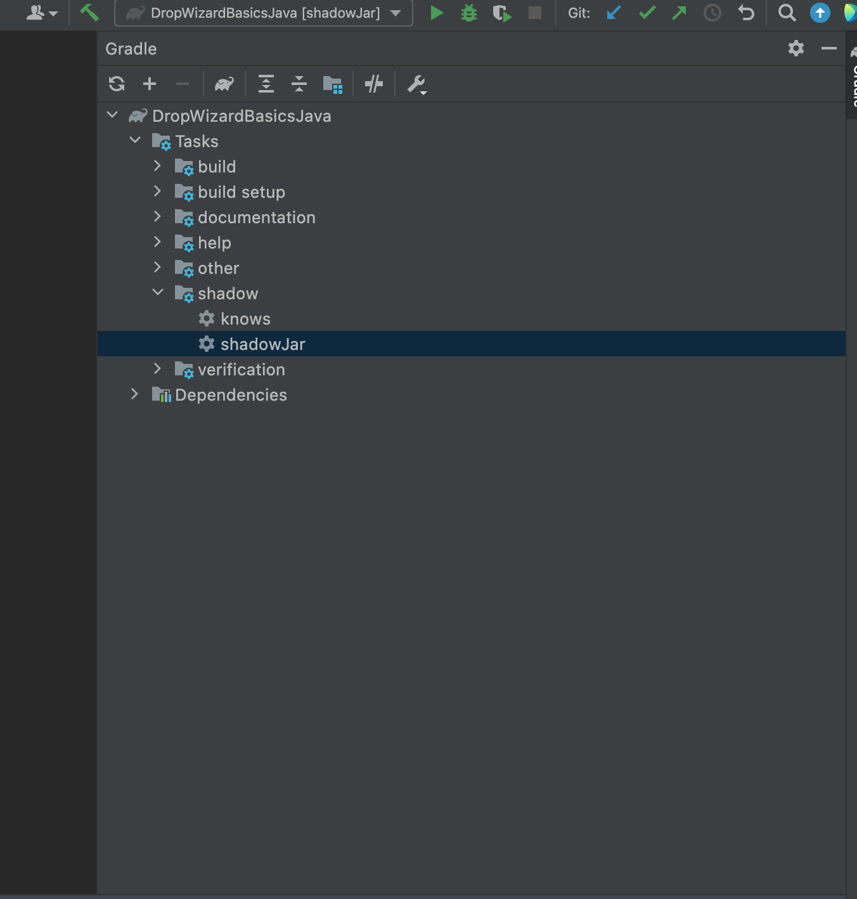

# workshop-materials/java-materials

This contains the subset of key examples from Java training session. The focus was on:

- DropWizard
- BDD
- Mocking

All locally managed examples built via Gradle.

## Recommendation

All examples are effectively run in Intellij Community Edition. The IDE offers ease of building and running the Java projects and creating Fat Jars for the micro service examples.

The repo contains many projects, open the project you need only in IntelliJ - simplifies running build commands/jars etc.

## Standalone Java Applications (Files only)

```java <filename>.java```

You can also right-click and run through an IDE, ensure to build first. IDE should pick up Gradle.

## DropWizard

- You can build a gradle app using ```./gradlew build```

- Need to build a fat jar, double click the indicated task to do that. Then generated from Gradle build file.



- Relies on build.gradle task to work.

````
shadowJar {
mergeServiceFiles()
}
````

- https://www.dropwizard.io/en/latest/getting-started.html#building-fat-jars

- http://localhost:8080/client/index.html - Example basic app serves this html from resource/assets, JS baked into the html.

## Gradle

Recommended over Maven as it can be used for multiple other langauges, enables setting up tasks as Groovy scripts and des not require any specific knowledge to build Maven plugins.
